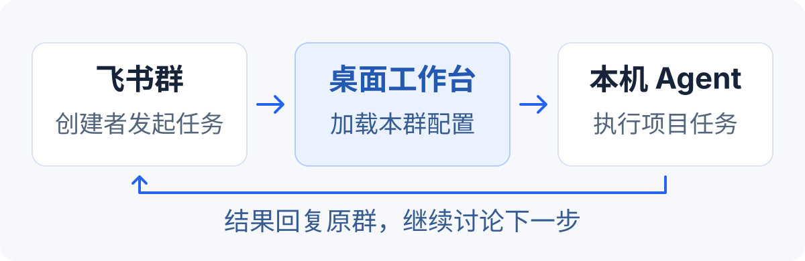

<p align="center">
  
</p>

<h1 align="center">Feishu Collaborator</h1>

<p align="center"><strong>让你电脑上的 AI Agent，在飞书群里参与项目工作。</strong></p>
<p align="center">连接飞书、本机 Agent 与项目资料，把任务入口放在日常沟通的地方。</p>

<p align="center">
  <a href="https://github.com/Miraclemin/feishu-collaborator/releases"></a>
  <a href="LICENSE"></a>
  
</p>

<p align="center">
  <a href="#快速开始">快速开始</a> ·
  <a href="#可以用它做什么">使用场景</a> ·
  <a href="#配置你的工作台">工作台配置</a> ·
  <a href="#日常使用与飞书命令">飞书命令</a> ·
  <a href="#电脑终端命令">终端命令</a> ·
  <a href="#常见问题">常见问题</a> ·
  <a href="#项目来源与致谢">来源与致谢</a>
</p>

---

## 这是什么

Feishu Collaborator 是一个开源桌面工作台，将飞书机器人连接到你电脑上已经安装的 <strong>Codex、Claude Code、Hermes 或 OpenClaw</strong>。

你可以在客户端里管理机器人，为不同飞书群选择工作目录、工作角色、Skills 和项目资料。配置完成后，已启用群的成员可在飞书群里发起任务，本机 Agent 执行，再把结果回复到群里。

它适合已经在使用本机 Agent，希望从飞书发起项目任务的开发者、产品负责人和独立创作者。你继续使用自己的模型账号、代码目录和飞书资料；客户端负责把这些入口连接起来。

> <strong>先认识一个使用前提：</strong>当前桌面工作台由机器人创建者管理配置，已启用群的成员可发起任务。任务使用当前机器人和本机 Agent 的权限；资料清单不提供严格访问隔离，请仅对可信群启用。

## 为什么做这个项目

一个项目的上下文往往散在不同地方：讨论在飞书群，需求和 Bug 在多维表格，代码在电脑里，而 Agent 又有自己的对话窗口。

当你想让 AI 帮忙时，经常要重新找链接、说明项目背景、切换工作目录，再把结果搬回群里。换一个项目，这些步骤又要做一遍。

Feishu Collaborator 希望减少这类重复准备：<strong>把群、项目目录、角色和资料关联起来，让你在熟悉的沟通入口发起工作。</strong>产品、研发、巡检可以有不同的角色配置，也可以围绕同一份需求或 Bug 记录继续讨论。具体要做什么、何时写入、何时上线，仍由任务要求和实际授权决定。

## 可以用它做什么

例如，你在维护一个产品，想先弄清楚一个反馈，再决定是否修改：

```text
你在飞书群 @ 自己的机器人：

“这是用户反馈的 Bug 记录：<记录链接>。
先结合当前项目代码分析原因，给出修改建议，暂时不要改代码。”
```

机器人使用这个群配置的本机引擎、工作目录和技能处理任务，并在群里回复。确认方案后，你可以继续给出下一步指令。读取飞书记录需要相应工具和资源权限；执行效果也取决于所选 Agent 与技能。

| 使用场景 | 你可以怎样配置和提问 |
| --- | --- |
| 整理需求 | 选择产品经理角色，关联需求表，请它梳理背景、问题与验收条件 |
| 分析与修复 Bug | 选择研发角色，指定代码目录和 Bug 表，从问题分析开始，再明确授权修改 |
| 检查产品体验 | 选择巡检角色，配合已安装的浏览器等技能，检查指定页面或流程 |
| 切换项目 | 给不同群设置各自的目录、资料和回复要求，减少重复说明 |
| 使用不同 Agent | 在同一工作台管理本机引擎，根据任务选择 Codex、Claude Code、Hermes 或 OpenClaw |

角色提供工作方向，Skills 提供任务指引；浏览器、飞书工具和其他技能依赖仍需在本机配置。选择角色本身不会自动完成整套业务流程。

## 它怎样工作

<p align="center">
  
</p>

1. <strong>飞书是任务入口。</strong>已启用群的成员 @ 机器人提出请求。
2. <strong>工作台提供群配置。</strong>找到对应的目录、角色、技能清单和项目资料。
3. <strong>本机 Agent 执行任务。</strong>沿用使用者自己的 Agent 登录状态，按所选工具及权限工作。
4. <strong>结果回到原群。</strong>你在讨论发生的地方查看回复，再决定下一步。

任务由你的电脑运行，电脑需要联网并保持唤醒。模型请求仍通过对应 Agent 的模型服务处理，“本机运行”不代表离线模型。

## 快速开始

### 1. 下载客户端

前往 <strong>[GitHub Releases 下载](https://github.com/Miraclemin/feishu-collaborator/releases)</strong>，根据电脑选择安装包：

| 系统 | 选择的文件 | 安装方式 |
| --- | --- | --- |
| macOS · Apple Silicon（M 系列） | `…-mac-arm64.dmg` | 打开 DMG，将应用拖入 Applications |
| macOS · Intel | `…-mac-x64.dmg` | 打开 DMG，将应用拖入 Applications |
| Windows · x64 | `…-win-x64.exe` | 运行安装向导，选择安装目录 |

当前提供预览版。Mac 安装包尚未经过 Apple 公证，Windows 安装包尚未商业签名，系统可能提示确认；Windows 实际安装运行仍待真机验证。下载页提供 `SHA256SUMS.txt` 校验文件，具体安装提示见[安装指南](docs/GETTING-STARTED.zh.md)。

### 2. 准备自己的 Agent

至少安装并登录下面一种本机 CLI，并先在终端确认它能够正常回答问题：

| 引擎 | 工作台中的使用方式 |
| --- | --- |
| Codex | 使用本机 Codex CLI 与登录状态 |
| Claude Code | 使用本机 Claude Code CLI 与登录状态 |
| Hermes | 使用本机 Hermes CLI；当前适配需要完整本机权限 |
| OpenClaw | 使用本机 OpenClaw CLI；当前适配需要完整本机权限 |

客户端会检测引擎是否安装。<strong>检测到安装不等于已经登录</strong>，模型订阅、API 配置与额度由你自行准备。使用第三方 Skill 时，也要安装它依赖的工具。

### 3. 创建 Agent，连接飞书

1. 打开客户端，<strong>新建 Agent</strong>，选择本机可用的引擎。
2. 按界面提示扫码，创建或绑定自己的飞书机器人。
3. 在权限准备页面选择需要的能力，复制权限配置，到对应飞书应用后台导入。
4. 完成飞书应用发布和企业审批（如需要），再回到客户端完成对应授权。
5. 将机器人加入用于测试的飞书群。

飞书应用权限与具体文档、表格的访问权限需要分别配置。导入权限配置不会自动让机器人获得所有资料的访问权。

### 4. 配置群，发出第一条消息

进入该 Agent 的工作台，点击 <strong>“搜索并选择群”</strong>，完成以下配置：

- <strong>角色：</strong>选择它在这个群负责产品、研发还是巡检。
- <strong>工作目录：</strong>选择本机项目文件夹。
- <strong>项目资料：</strong>填写项目名称、网址，以及需要关联的需求表、Bug 表或其他飞书资料。
- <strong>Skills：</strong>勾选本群任务需要加载的技能。
- <strong>群状态：</strong>打开“在这个群启用”，保存配置并启动 Agent。

然后，在已启用的飞书群里 @ 机器人：

```text
@你的机器人 你好，请介绍一下你在这个群里的工作角色。
```

收到回复后，再尝试一个范围明确的任务：

```text
@你的机器人 请阅读当前项目的 README，概括它的用途，不修改文件。
```

## 配置你的工作台

### 按群组织项目

同一个机器人可以为不同群保存各自的项目配置。比如，产品 A 的群使用产品 A 的代码目录和需求表，产品 B 的群使用另一套配置。

| 配置项 | 用途 |
| --- | --- |
| 工作角色 | 为群里的任务设置产品经理、研发或巡检方向 |
| 项目名称与网址 | 帮助 Agent 理解正在处理哪个产品 |
| 本机工作目录 | 确定任务启动时所在的目录 |
| 需求表与 Bug 表 | 提供业务记录入口，可通过界面选择具体表格 |
| 其他飞书资料 | 补充本群需要参考的文档链接 |
| 人格与回复要求 | 例如“先给结论，再给一个具体例子” |
| 技能清单 | 选择本群任务需要加载的 Skills |

<strong>目录与资料链接是工作上下文。</strong>工作目录不是文件访问沙箱，资料链接也不构成严格的逐文档访问控制。只配置你愿意让该 Agent 使用的目录和工具权限。

### Skills 与工具

工作台可以发现本机及工作目录中的技能，并提供内置角色和飞书工作指引。选择角色时，会加入相应角色与基础飞书技能；你可以继续调整本群的清单。

Skill 通常是一份任务指引，告诉 Agent 如何做某类工作。勾选 Skill 不会自动安装浏览器工具、配置 MCP、登录飞书 CLI，或开通接口权限。首次使用一项能力时，先检查它的依赖和授权是否齐全。

### 切换引擎

你可以在工作台切换本机引擎，继续使用同一个飞书机器人。切换会开始新对话；正在运行任务时需要先等任务结束。不同引擎支持的权限模式和会话机制有所不同，详情见[工作台说明](docs/WORKBENCH.md)。

## 日常使用与飞书命令

### 在哪里输入？

下面以 `/` 开头的命令，发送在<strong>飞书与机器人的对话里</strong>，不要输入电脑终端。在群里先通过飞书的 @ 菜单选中机器人，再输入命令；私聊直接输入命令即可。

```text
@你的机器人 /status
```

每条命令单独发送。示例中的 `<路径>`、`<名称>` 等表示需要替换的参数，实际输入时不带尖括号；`[会议号]` 表示可选参数。管理类命令受创建者/管理员规则限制，桌面工作台的管理操作要求创建者身份，普通任务要求群已启用。

### 会话与任务

| 命令 | 怎么用 |
| --- | --- |
| `/help` 或 `/usage` | 查看帮助、可用命令和本群技能提示 |
| `/status` | 查看当前运行状态、会话和项目入口 |
| `/new` 或 `/reset` | 中断当前任务并开始新会话，不删除项目文件 |
| `/stop` | 请求中断当前对话正在执行的任务；不会关闭机器人 |
| `/resume` | 查看可恢复的会话；群里不展示历史详情，请私聊机器人操作 |
| `/resume use <候选值>` | 使用 `/resume` 返回的按钮或候选值恢复，不要自行填写其他会话 ID |
| `/timeout` | 查看当前会话的探活超时设置 |
| `/timeout 15` | 将当前会话的探活超时设为 15 分钟，支持 1–120 分钟 |
| `/timeout off` | 关闭当前会话的探活超时 |
| `/timeout default` | 清除当前会话覆盖，恢复全局配置 |

`/new` 会清除当前会话的超时覆盖。恢复能力随引擎和会话上下文而异；Codex 返回的恢复候选有效期为 10 分钟，需要使用当前上下文生成的候选。

<strong>一个日常使用顺序：</strong>

```text
@你的机器人 /status
@你的机器人 请阅读当前项目的 README，概括项目用途，不修改文件。
@你的机器人 请继续分析登录流程，列出你发现的问题。
@你的机器人 /stop
@你的机器人 /new
```

以上五行是五条独立消息。`/stop` 用在任务执行中需要打断时，`/new` 用在准备换话题时；正常完成任务后不必每次都发送。

### 工作目录与目录别名

| 命令 | 示例与作用 |
| --- | --- |
| `/cd <绝对路径>` | `/cd /Users/你的用户名/Projects/demo`，切换当前对话工作目录 |
| `/cd ~/Projects/demo` | macOS/Linux 可使用 `~` 表示主目录 |
| `/ws` 或 `/ws list` | 查看保存的工作目录别名 |
| `/ws save <名称>` | `/ws save demo`，把当前已设置的目录保存为别名 |
| `/ws use <名称>` | `/ws use demo`，切换到已保存目录 |
| `/ws remove <名称>` | `/ws remove demo`，删除别名，不删除目录中的文件；也可用 `/ws rm demo` |

桌面用户优先在工作台选择群工作目录。`/cd` 和 `/ws` 是聊天中的目录操作，使用后通过 `/status` 核对实际目录；不要将它们当成操作系统文件隔离。

### 项目与资料绑定

在目标群或 Topic 中逐条发送命令，绑定只影响<strong>当前机器人和当前群/Topic</strong>：

```text
@你的机器人 /project show
@你的机器人 /project set name 我的产品
@你的机器人 /project set url https://example.com
@你的机器人 /project set repo /Users/你的用户名/Projects/demo
@你的机器人 /project set requirements 你的飞书需求表完整链接
@你的机器人 /project set bugs 你的飞书Bug表完整链接
```

| 字段 | 含义 |
| --- | --- |
| `name` | 项目或产品名称 |
| `url` | 产品访问网址 |
| `repo` | 本机源码目录，不是 GitHub 仓库网址 |
| `requirements` | 需求表链接 |
| `bugs` | Bug 表链接 |
| `records` | 巡检记录表链接 |
| `directions` | 巡检方向表链接 |
| `logs` | 探索日志表链接 |

更多示例：`/project set records <完整表格链接>`。表格链接应包含 `/base/` 及具体的 `table=tbl...` 参数；`/project help` 可随时查看说明。

修改绑定需要管理权限；当前有任务运行时先等任务结束或用 `/stop` 中断。保存项目绑定会重置当前对话。`repo` 指定源码位置，`/cd` 切换执行目录，两者不会自动改变执行权限，也不会新建定时任务。该组命令依赖 Python 项目绑定工具，目前使用 Unix 文件锁。

### 配置与故障诊断

| 命令 | 用途与示例 |
| --- | --- |
| `/config` | 打开配置卡片，按卡片操作调整模型、权限等设置 |
| `/account` | 查看当前飞书账号绑定入口 |
| `/account change` | 进入账号更换流程，受身份和权限规则约束 |
| `/doctor` | 检查工作目录与 Agent 响应；可能发起一次模型调用 |
| `/doctor <问题描述>` | 例如 `/doctor 最近请求没有回复`，携带故障描述诊断 |
| `/reconnect --wait` | 等当前任务结束后重连 |
| `/reconnect` | 停止当前运行并立即重连 |
| `/ps` | 查看本机 Bridge 运行进程及短 ID |
| `/exit <短ID或序号>` | 退出 `/ps` 列出的指定进程；会停止该进程服务 |

<strong>机器人回复异常时：</strong>先 `/status` 查看状态，再 `/doctor` 获取诊断；需要重连时优先 `/reconnect --wait`。如果机器人完全不回复，就在客户端检查是否启动，或使用下文的终端 `status` 命令查看服务状态和日志路径。

<details>
<summary><strong>会议命令：入会、字幕、纪要与提问</strong></summary>

先在 `/config` 或控制台启用“会议智能体”，完成相应飞书权限配置并重启机器人。会议能力还取决于应用权限、会议准入和字幕来源；机器人入会不等于已经拿到会议字幕。

| 命令 | 用法 |
| --- | --- |
| `/meeting` 或 `/meeting status` | 查看正在跟进的会议与状态 |
| `/meeting join <9位会议号>` | 例如 `/meeting join 123456789`，替换成真实的 9 位纯数字会议号，不是会议链接 |
| `/meeting transcript [会议号]` | 查看 Agent 实际收到的字幕上下文 |
| `/meeting notes [会议号]` | 根据已收到的字幕生成纪要，回复到发起命令的对话 |
| `/meeting ask <问题>` | 例如 `/meeting ask 刚才确认了哪些待办？` |
| `/meeting stop [会议号]` | 中断该会议正在运行的 Agent 任务，不等于离会 |
| `/meeting leave [会议号]` | 让机器人离开会议 |

同时跟进多场会议时，`notes`、`transcript`、`stop` 和 `leave` 应带会议号。`ask` 不接受前置会议号来选择会议，多场会议时按机器人提示处理。想单独收到纪要，应在私聊中发起命令。

建议顺序：`join` → `status` → `transcript` 确认有内容 → `notes` 或 `ask` → `leave`。具体能力说明见[会议说明](docs/MEETING-LISTENING.md)。

</details>

<details>
<summary><strong>进阶：群、访问名单与指定任务管理</strong></summary>

以下是 Bridge 保留的管理命令。修改名单不会绕过桌面工作台的管理权限限制，也不会自动完成新群的工作台配置。

| 命令 | 作用 |
| --- | --- |
| `/new chat <群名称>` | 创建新群并继承原对话目录；需要建群权限，工作台模式下还需配置并启用新群 |
| `/invite user @某人` | 将被 @ 的人加入允许私聊名单 |
| `/invite admin @某人` | 将被 @ 的人加入管理员名单 |
| `/invite group` | 在目标群发送，将当前群加入响应名单 |
| `/invite all group` | 将机器人所在的群批量加入响应名单 |
| `/remove user @某人` | 从用户允许名单中移除 |
| `/remove admin @某人` | 从管理员名单中移除 |
| `/remove group` | 在目标群发送，从响应名单中移除当前群 |
| `/stop <scope>` | 管理员中断指定作用域中的任务，使用状态信息提供的 scope |
| `/timeout comment:<scopeHash> 15` | 管理员为指定文档评论作用域设置探活超时 |
| `/doc` | 查看文档评论触发方式的提示；不是读取任意文档的命令 |

`@某人` 应使用飞书真实的 @ 选择，不是手打一个名字。名单移除不等于把成员踢出飞书群。会议、群管理和评论功能均需要对应平台权限。

</details>

## 电脑终端命令

这一节在<strong>电脑终端</strong>操作，不发送到飞书。只使用桌面 App 的用户可以通过界面完成日常配置，不必安装全局命令。

### 如何运行 CLI

从源码安装依赖并执行 `pnpm build` 后，在仓库目录运行：

```bash
node bin/lark-channel-bridge.mjs --help
node bin/lark-channel-bridge.mjs --version
```

下文统一使用 `node bin/lark-channel-bridge.mjs`，无需全局安装，也不会混用其他版本的 Bridge。若已经从本仓库构建并全局安装包，可替换为 `feishu-collaborator` 或兼容别名 `lark-channel-bridge`。当前不提供从 npm 安装本项目的指令。

`profile` 表示一套机器人配置。下面的 `my-bot` 是示例名称，可以换成自己的名称。CLI 默认使用 `~/.lark-channel`，与桌面默认的 `~/.lark-workbench` 分开；刚安装 CLI 时看不到桌面 Agent 属于正常情况，不要同时启动同一套机器人凭据。

### 第一次创建并启动

```bash
# 创建配置，选择 Codex 和自己的项目目录；跟随交互完成飞书连接
node bin/lark-channel-bridge.mjs profile create my-bot --agent codex --workspace "/你的项目绝对路径"

# 查看配置列表，并设为默认配置
node bin/lark-channel-bridge.mjs profile list
node bin/lark-channel-bridge.mjs profile use my-bot

# 前台运行：终端保持打开，按 Ctrl+C 结束
node bin/lark-channel-bridge.mjs run --profile my-bot
```

命令行创建时 `--agent` 支持 `claude` 或 `codex`。其他引擎通过桌面工作台配置。已有飞书应用可在创建时指定 `--app-id <AppID>`，App Secret 按交互提示输入，不建议直接写进终端历史。

### 前台运行与网页控制台

| 命令（接在 `node bin/lark-channel-bridge.mjs` 后） | 作用 |
| --- | --- |
| `run --profile my-bot` | 前台运行一个机器人 |
| `run --web-ui` | 前台启动统一管理服务与本地网页控制台，可管理多个 profile |
| `ui` | 打开本地控制台 |
| `ui --print` | 打印控制台地址，不自动打开浏览器 |
| `ps` | 列出本机运行中的 Bridge 进程 |
| `kill <短ID或序号>` | 停止 `ps` 中指定进程；系统管理的服务可能再次拉起它 |

### 后台服务：启动、停止与日志

后台服务由操作系统管理：macOS 使用 launchd，Linux 使用 systemd，Windows 使用计划任务；是否能够注册和启动取决于本机环境。

```bash
# 安装并启动后台服务
node bin/lark-channel-bridge.mjs start --profile my-bot

# 查看进程、最近退出状态和日志文件路径
node bin/lark-channel-bridge.mjs status --profile my-bot

# 重启服务
node bin/lark-channel-bridge.mjs restart --profile my-bot

# 停止服务并禁用自启动，保留服务定义
node bin/lark-channel-bridge.mjs stop --profile my-bot

# 移除系统服务注册，不用于删除项目源码
node bin/lark-channel-bridge.mjs unregister --profile my-bot
```

需要后台运行统一网页控制台时使用 `start --web-ui`，对应管理命令为 `status --web-ui`、`restart --web-ui`、`stop --web-ui` 和 `unregister --web-ui`。

<strong>三个“停止”的区别：</strong>飞书 `/stop` 中断当前任务；终端 `stop` 停止系统后台服务；终端 `kill` 停止指定进程。前台 `run` 用 Ctrl+C 退出。

<details>
<summary><strong>进阶：配置导出、归档、迁移与密钥管理</strong></summary>

以下命令仍接在 `node bin/lark-channel-bridge.mjs` 后执行：

| 命令 | 作用 |
| --- | --- |
| `profile export my-bot --output ./my-bot.json` | 导出配置；默认不包含密钥，仍可能含本机路径等私人信息 |
| `profile export my-bot --output ./my-bot.json --force` | 覆盖已有导出文件 |
| `profile remove my-bot` | 归档机器人配置及本地状态 |
| `profile remove my-bot --purge --yes` | 永久删除该配置状态，操作前自行备份 |
| `migrate --config /旧配置绝对路径 --profile my-bot --agent codex` | 将旧版配置迁移到 profile 布局；仅旧配置迁移时需要 |
| `secrets set --app-id cli_xxx --profile my-bot` | 交互输入并加密保存 App Secret |
| `secrets list --profile my-bot` | 列出已保存的密钥 ID，不展示密钥内容 |
| `secrets remove --app-id cli_xxx --profile my-bot` | 删除指定密钥条目，依赖它的机器人可能无法连接 |

导出支持 `--include-secrets --yes`，会包含敏感凭据，不应用于给别人分享客户端。`secrets get` 是供工具调用的 JSON 标准输入/输出协议接口，通常不需要手动使用。

</details>

### 随时查看完整参数

```bash
node bin/lark-channel-bridge.mjs --help
node bin/lark-channel-bridge.mjs run --help
node bin/lark-channel-bridge.mjs profile create --help
node bin/lark-channel-bridge.mjs profile export --help
node bin/lark-channel-bridge.mjs start --help
node bin/lark-channel-bridge.mjs secrets --help
```

`--profile <名称>` 用于指定机器人；`run --config <路径>` 用于指定配置文件；`--tenant feishu` / `--tenant lark` 用于创建或首次配置时选择平台。以当前版本的 `--help` 输出为准。

## 常见问题

### 需要部署服务器吗？

使用桌面客户端不需要另行部署服务器。任务在本机运行，客户端、网络和 Agent 必须可用。关闭最后一个应用窗口会停止该客户端管理的机器人；电脑休眠后也不能继续正常处理新任务。

### 可以分享给朋友吗？

可以，直接分享[下载页面](https://github.com/Miraclemin/feishu-collaborator/releases)即可。朋友需要在自己的电脑安装客户端，登录自己的 Agent，并绑定自己的飞书机器人。不要把自己的 App Secret、token 或配置目录一起发送。

### 同一个群里的其他人也能调用吗？

可以。创建者在软件中启用该群后，群成员可发起任务；配置仍由创建者管理。仅把机器人加进群不会自动启用。任务使用机器人及本机 Agent 的权限，不等于每位提问者各自的文档权限；回复会出现在群里，请仅对可信群启用。

### 找不到群，或者读不了表格怎么办？

先检查机器人是否已加入目标群，再检查应用权限是否开通并发布、相应扫码授权是否完成，以及实际使用的身份是否有该文档或表格的访问权。“群已绑定”和“资料能读取”是两个独立条件。

### 配置保存在哪里？

桌面客户端默认使用 `~/.lark-workbench`；命令行工具默认使用 `~/.lark-channel`。这些目录包含本机配置和运行数据，请妥善保管。开发时可通过 `LARK_WORKBENCH_HOME` 为桌面客户端指定其他目录。

## 从源码运行

适合希望修改项目或参与贡献的开发者。需要 <strong>Node.js 22.12+、pnpm 10.33.0</strong>；使用 Python 项目绑定工具时还需要 Python 3.9+，该工具目前依赖 Unix 文件锁。

```bash
git clone https://github.com/Miraclemin/feishu-collaborator.git
cd feishu-collaborator
corepack enable
pnpm install --frozen-lockfile
pnpm desktop:dev
```

常用开发命令：

```bash
pnpm typecheck       # TypeScript 类型检查
pnpm test            # 自动化测试
pnpm build           # 构建前端与 Bridge
pnpm desktop:pack    # 生成本机应用目录
pnpm desktop:dist    # 生成当前平台安装包
```

桌面程序基于 <strong>Electron + React + TypeScript</strong>，底层复用 Bridge 的消息通道、配置管理和 Agent 适配器。前端使用 Vite 构建，通过 electron-builder 打包。

## 文档与参与

- [安装与首次使用](docs/GETTING-STARTED.zh.md)：下载安装、初次连接与分享。
- [工作台说明](docs/WORKBENCH.md)：引擎适配、技能机制与权限行为。
- [上游中文文档](docs/UPSTREAM-README.zh.md)：了解底层 Bridge 的背景与原有用法。
- [提交 Issue](https://github.com/Miraclemin/feishu-collaborator/issues)：反馈问题或讨论想法。

欢迎通过 Issue 和 Pull Request 参与改进。报告问题时请附操作系统、客户端版本、所用引擎、复现步骤与脱敏后的错误信息；不要提交密钥、访问令牌或私有聊天内容。

## 项目来源与致谢

Feishu Collaborator 基于 [Miraclemin/lark-team-agent-bridge](https://github.com/Miraclemin/lark-team-agent-bridge) 独立演进，延续其飞书消息连接与项目配置能力，并增加桌面工作台、按群配置、本机多引擎选择及项目资料入口。

其源码基础来自 [zarazhangrui/feishu-claude-code-bridge](https://github.com/zarazhangrui/feishu-claude-code-bridge)。感谢上游作者和贡献者提供飞书与本机 Agent 之间的连接基础。本仓库保留上游许可证与原版文档。

也感谢 Electron、React、TypeScript、Vite 等开源项目，以及相关 Agent 和飞书工具生态的建设者。

## License

本项目以 <strong>[MIT License](LICENSE)</strong> 开源。你可以在遵守许可证条件的前提下使用、修改和分发，也可以用于商业用途；分发时需要保留版权声明和许可证声明。

项目保留上游版权声明。第三方依赖遵循各自的许可证；模型服务与飞书服务的使用仍适用其各自条款。


### 团队资料与 Skill 分享

- 群设置中选择“分享本群资料”，复制链接清单发到飞书；同事使用“从飞书导入资料清单”，检查权限后保存。链接不会自动授予飞书访问权限。
- 首页“团队资源”支持读取 Git HTTPS 仓库，预览并安装每个包含 `SKILL.md` 的目录，再到群设置勾选启用。私有仓库需本机已配置 Git HTTPS 登录。
- 同名且全部文件内容一致的本机 Skill 会直接复用，不重复安装；内容不同的版本独立保留。安装不会执行技能脚本。
- 目前不包含自动订阅新增资料、上传本地 Skill 到 Git 或跨机器自动派活。
